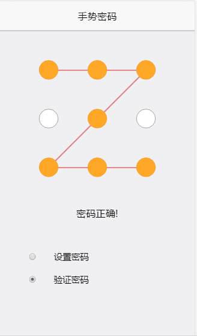

### 项目名称：手势密码锁

### 实例

### 原理和实现思路
#### 布局：
1. 页面上九个点使用ul嵌套li标签，直线在canvas上画
2. 因为li标签需要用户操作，所以将canvas绝对定位，并且设置z-index为负值

#### 用户交互
1. touchstart事件触发，记录当前li标签索引，并加入整个手势数组中
2. touchmove事件触发，记录当前手势移动到的位置，如果在九个点的某一个，在canvas上画出连线，并将当前点push到手势数组
3. touchend事件触发，判断当前是设置密码状态还是验证密码状态，如果是设置密码，见4，如果是验证密码，见5
4. 判断用户刚输入的密码长度是否大于等于5，如果是并且firstSet的长度为0，则存入firstSet数组中，提醒用户再次输入，如果firstSet长度不为0，则判断这次输入和firstSet中的密码是否相等，如果相等则设置密码成功，并且存入localStorage中
5. 判断用户输入的密码和localStorage中的密码是否相等，如果相等提醒输入正确

#### 源码说明
src文件夹中为源代码
dist文件夹中为通过gulp压缩后的代码，也是html文件中引入的文件
